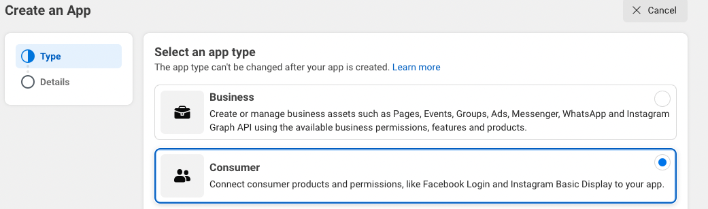
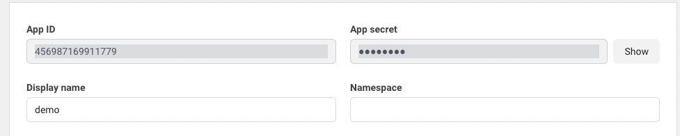
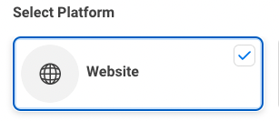
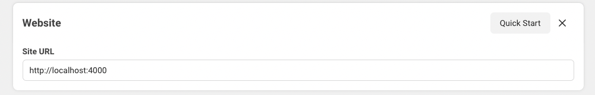

<div align="center">

# `elixir-auth-facebook`


[](http://codecov.io/github/dwyl/auth?branch=master)
[](https://hex.pm/packages/auth)
[](https://libraries.io/hex/auth)
[](https://hexdocs.pm/auth/api-reference.html)
[](https://github.com/dwyl/auth/issues)
[](http://hits.dwyl.com/dwyl/elixir-auth-facebook)


[](http://codecov.io/github/dwyl/auth?branch=master)
[](https://hex.pm/packages/auth)
[](https://libraries.io/hex/auth)
[](https://hexdocs.pm/auth/api-reference.html)
[](https://github.com/dwyl/auth/issues)
[](http://hits.dwyl.com/dwyl/elixir-auth-facebook)

</div>

_Easily_ add `Facebook` login to your `Elixir` / `Phoenix` apps with step-by-step **_detailed_ documentation**.

## Why?

Facebook authentication is used **_everywhere_**!
Tens of millions of people use it every day.

Facebook Login can be used to authenticate people without planning to access their data.

We wanted to create a reusable `Elixir` package
with beginner-friendly instructions and readable code.

## What?

A simple and easy-to-use `Elixir` package that gives you **Facebook `OAuth` Authentication** for your **web app** in a few steps with minimal API.

❗️ If you target Android or IOS, use the SDK.

> If you're new to `Elixir`,
> please see: [dwyl/**learn-elixir**](https://github.com/dwyl/learn-hapi)

## How?

These instructions will guide you through setup in 5 simple steps.
By the end, you will have **login with `Facebook`** in your **Web** App.

> **Note**: if you get stuck,
> please let us know by opening an issue!

### Step 1: Create a Facebook app

You need to have a Facebook developer account.
It is free. You just use your Facebook account.
You will create an app there and get the **credentials** _in minutes_.

### Step 1.1 Create or use a developer account from your personal Facebook account

Go to <https://developers.facebook.com/apps/>

...after logging in to your Facebook account, you can 'Register Now' for a developer account.

### Step 1.2 Create an App

- select the app type, for example "consumer"



- provide basic info, such as app name (can be changed), contact name

### Step 1.3 Your credentials

Once you are done, you arrive at the Dasboard.
Select **settings**, then **basic**.

You will find your credentials there.



Copy the App ID and the App Secret into your **`.env`** file.

```env
#.env
export FACEBOOK_APP_ID="123456789"
export FACEBOOK_APP_SECRET="A1B2C3D4"
```

> **Note**: at the bottom of this form, you need to fill in the 'Data Protection Officer" for the GDPR.

### Step 1.4 Specify the base redirect URI

Lastly, you need to set the callback base URL. Your app won't work if a wrong or incomplete base URL is set.

- at the bottom of the form, click on + Add platform


- select "Webiste" in the modal



- a new input will appear: fill the **Site URL** with: <http://localhost:4000>



**Note**: the redirect URI has to be an _absolute_ URI, not only the domain. Make sure you include the `http://` prefix.

## Step 2: use the `ElixirAuthFacebook` module

You want to display a **login** link on one of your pages. We will need the credentials and add a little bit of code.

### 2.1 Create a `state` token

You need to generate an "anti-CSRF" token.

You can use `mix gen.secret 32` for this from your terminal.
Append the result to the `FACEBOOK_STATE` key in your `.env` file.

```env
# .env
export FACEBOOK_APP_ID="got_u_from_dev_fb"
export FACEBOOK_APP_SECRET="got_u_from_dev_fb"
export FACEBOOK_STATE= "got_u_from_mix_gen_secret
```

Run `source .env` to load them in DEV mode.

Alternatively hardcode your secrets to your [`config/runtime.exs`] file:

```elixir
config :elixir_auth_facebook,
  app_id: "got_u_from_dev_fb",
  app_secret: "got_u_from_dev_fb",
  app_state: "got_u_from_mix_gen_secret"
```

See: <https://hexdocs.pm/phoenix/deployment.html#handling-of-your-application-secrets>

### 2.2 Add a login link in your template ✨

Suppose you have a template located at "/tempaltes/page/index.html" - rendered by the controller "PageController" - where you want to add the Facebook Login link.

Add this code:

```html.heex
# /lib/app_web/templates/page/index.html.heex

<a class="your-classes" href={@oauth_facebook_url}>
  
</a>
```

### 2.3 Modify the template controller

The previous `href` value is `@oauth_facebook_url`.
This is an "assign", a key/value map passed to the `conn` struct.
It is set by using the module `ElixirAuthFacebook`.

In the "page" controller that renders the template above, add the code below:

```elixir
# lib/app_web/controllers/page_controller.ex

defmodule AppWeb.PageController do
  use Phoenix.Controller

  def index(conn, _p) do
    oauth_facebook_url =
      ElixirAuthFacebook.generate_oauth_ur(conn)

    render(
      conn,
      "index.html",
      oauth_facebook_url: oauth_facebook_url
    )
  end
end
```

### 2.4 Create the `/auth/facebook/callback` endpoint 📍

Once the user has filled out the dialogue form, he will be redirected to your app.

Add this line to set the redirection endpoint in the router:

```elixir
#AppWeb.Router

scope "/", AppWeb do
  pipe_through :browser
  # Facebook endpoint
  get "/auth/facebook/callback",
    FacebookAuthController, :login
end
```

### 2.5 Create a `FacebookAuthController`

Last step! We finally need a controller to respond to the endpoint:

```elixir
# lib/app_web/controllers/facebook_auth_controller.ex

defmodule AppWeb.FacebookAuthController do
  use Phoenix.Controller

  def login(conn, params) do

    {:ok, profile} =
      ElixirAuthFacebook.handle_callback(
        conn, params
      )

  #[... process the profile for the next render..]
  end
end
```

Done! :rocket:

Facebook will send the user's credentials to the endpoint you created, and the controller/callback will receive them in the `params`.
We use again the `ElixirAuthFacebook` module to handle these "params" and deliver the user's identity.

It eventually sends back the object below which identifies the user :eyes:

```elixir
%{
  access_token: "EAAFNaUA6VI8BAPkCCVV6q0U0tf7...",
  email: "xxxxx",
  fb_id: "10223726006128074",
  name: "Harry Potter",
  picture: %{
    "data" => %{
      "height" => 50,
      "is_silhouette" => false,
      "url" => "xxxxx",
      "width" => 50
    }
  }
}
```

A long-term "access_token" is delivered.
The app can interact with the Facebook ecosystem on behalf of the user with this token. These tokens should be saved in the database and appended to a session. If you intend to do so, have a look at the data deletion policy at the end.

> If you simply need to authenticate a user, this token is useless and everything is fine.

### A note on SSL certificate :lock:

**TL;DR**: if you use this module, you don't need a reverse proxy in DEV mode.

:exclamation: if the user denies the login in this mode, then the app stops since it wants to reach an HTTPS endpoint. This is the only limitation.

#### How-to HTTPS :fearful: locally?

It's a piece of cake with **[Caddyserver](https://caddyserver.com/docs/)**. It supports automatic HTTPS by provisioning and renewing certificates through [Let’s Encrypt](https://letsencrypt.org/) for you.

Install it in minutes, create a file named `CaddyFile` at the root, paste the code below in it, and type `caddy run` in a different terminal. That's it :tada:

```
localhost:443 {
	handle {
		reverse_proxy 127.0.0.1:4000
	}
}
```

A reverse proxy is a piece of software between the internet and your app. It intercepts the traffic and forwards it back to the app.

Once it is running, your app can be reached at <https://localhost>.
Of course, your app is still running as normal behind, on <http://localhost:4000>. The port differentiates these modes.

### SDK :thought_balloon: ?

The [Facebook SDK](https://developers.facebook.com/docs/javascript/quickstart) is the alternative _authentication from the browser_.
You **need** to reverse proxy your app (_and also enable the JSSDK in Facebook's app settings_). With Caddyserver, this is made easy for your dev mode.

The SDK usage is demonstrated in the companion repo: **<TODO: elixir_auth_facebook_demo>**.

This solution is preferable when running a free app as you consume less server CPU.

### Notes 📝

All the flow to build the Login flow can be found here:
<https://developers.facebook.com/docs/facebook-login/guides/advanced/manual-flow>

#### Meta - Privacy Concerns? 🔐

No cookie is set. It just provides user authentication.

You have the tokens to do more,❗️ but do you want an [opinion(?)](https://archive.ph/epKXZ) on Meta?

Use this package as a last resort if you have no other option!

#### Meta - Data deletion?

If you want to use the package to access Metas' ecosystem, then you need to provide [a data deletion option](https://developers.facebook.com/docs/facebook-login/overview)

❗️ To be compliant with GDPR guidelines, you must provide the following:

- A way in your app for users to request their data be deleted
- A contact email address that people can use to reach you to request their data be deleted
- An implementation of the data deletion callback
